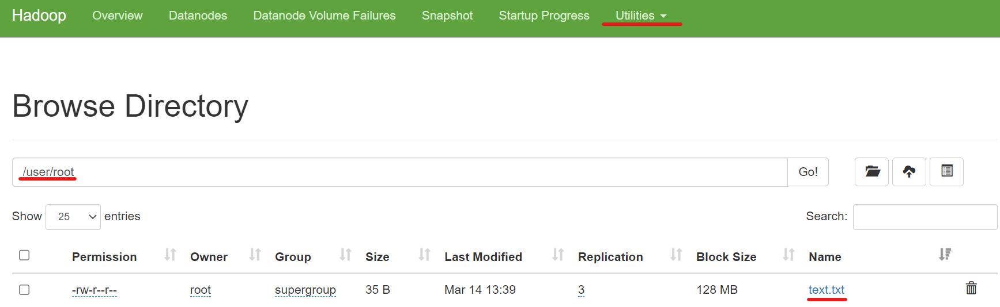

# Déploiement de donnée sur Hadoop avec Python et Spark

Nous allons importer et pousser un fichier csv sur notre cluster et génerer un graphique.


## Prérequis

- Git

- Docker Engine

- Docker Compose

- [Cluster Hadoop](https://github.com/baha1218/HadoopCluster) sur la `VM1`

- [Datanode distant](https://github.com/baha1218/HadoopDatanode) sur la `VM2`

## 🛠 Configuration

### Hosts : 

Dans un premier temps, nous allons installer pyspark sur `VM1` et `VM2`. Mes machine sont des Red Hat donc j'utilise dnf pour installer mes paquets.

```bash
dnf install python3
dnf install python3-pip
pip3 install pyspark
```

Nous allons maintenant installer pyspark sur nos 5 conteneurs. 


### Datanode : 

Obtenez les ids de votre conteneur

```bash
docker ps
```

Connectez vous au conteneur grace à l'id

```bash
docker exec -ti <id> bash
```

Installez pyspark
```bash
apt-get install python3
apt-get install python3-pip
pip3 install pyspark
/usr/local/spark/sbin/start-worker.sh spark://namenode:7077
```

### Namenode : 

Obtenez les ids de votre conteneur

```bash
docker ps
```

Connectez vous au conteneur grace à l'id

```bash
docker exec -ti <id> bash
```

Installez pyspark
```bash
apt-get install python3
apt-get install python3-pip
pip3 install pyspark
/usr/local/spark/sbin/start-master.sh
```
Une fois l'installation terminé sur notre cluster, toutes le reste de la configuration se fera sur votre namenode.

Installez un editeur de texte

```bash
apt-get install nano
```
Créer un fichier `text.txt` et écrivez quelques mots
```bash
nano text.txt
```
Poussez le fichier `text.txt` dans votre cluster dans le repertoire /user/root
```bash
hadoop fs -mkdir /user
hadoop fs -mkdir /user/root
hadoop fs -put text.txt
```
Vérifiez sur le webui dans Utilities/Browse the file system



