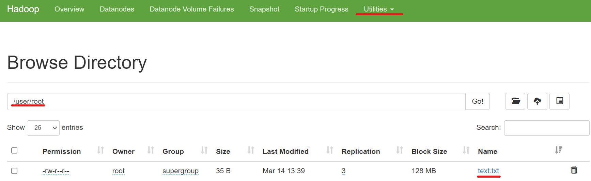

# Déploiement de donnée sur Hadoop avec Python et Spark

Dans cette documentation nous allons : 
- Compter les données dans notre cluster
- Importer et pousser un fichier csv sur notre cluster 
- Génerer un graphique


## Prérequis

- Git

- Docker Engine

- Docker Compose

- [Cluster Hadoop](https://github.com/baha1218/HadoopCluster) sur la `VM1`

- [Datanode distant](https://github.com/baha1218/HadoopDatanode) sur la `VM2`

## 🛠 Configuration

### Hosts : 

Dans un premier temps, nous allons installer pyspark sur `VM1` et `VM2`. Mes machine sont des Red Hat donc j'utilise dnf pour installer mes paquets.

```bash
dnf install python3 && dnf install python3-pip && pip3 install pyspark
```

Nous allons maintenant installer pyspark sur nos 5 conteneurs. 


### Datanode : 

#### Configuration des datanodes sur la `VM1`

Obtenez les ids de votre conteneur.

```bash
docker ps
```

Connectez vous au conteneur grace à l'id.

```bash
docker exec -ti <id> bash
```

Installez pyspark.
```bash
apt-get install python3 && apt-get install python3-pip && pip3 install pyspark
/usr/local/spark/sbin/start-worker.sh spark://namenode:7077
```
#### Configuration du datanode sur la `VM2`

Obtenez l'id de votre conteneur.

```bash
docker ps
```

Connectez vous au conteneur grace à l'id.

```bash
docker exec -ti <id> bash
```

Installez pyspark en renseignant la bonne <ip>, celle de la `VM1`.
```bash
apt-get install python3 && apt-get install python3-pip && pip3 install pyspark
/usr/local/spark/sbin/start-worker.sh spark://<ip>:7077
```

### Namenode : 

Obtenez les ids de votre conteneur.

```bash
docker ps
```

Connectez vous au conteneur grace à l'id.

```bash
docker exec -ti <id> bash
```

Installez pyspark.
```bash
apt-get install python3 && apt-get install python3-pip && pip3 install pyspark
/usr/local/spark/sbin/start-master.sh
```
Une fois l'installation terminé sur notre cluster, tout le reste de la configuration se fera sur votre namenode.

Installez un editeur de texte.

```bash
apt-get install nano
```
Créer un fichier `text.txt` et écrivez quelques mots.
```bash
nano text.txt
```
Poussez le fichier `text.txt` dans votre cluster dans le repertoire /user/root
```bash
fs -mkdir -p /user/root/
hadoop fs -put text.txt
```
Vérifiez sur le webui dans Utilities/Browse the file system.


Créer un dossier `spark-logs` dans votre cluster.
```bash
hadoop fs -mkdir /spark-logs
```

Créer un fichier [text.py](https://github.com/baha1218/HadoopPython/blob/main/file/text.py)
```bash
nano text.py
```

Vous pouvez maintenant executer le script qui va compter le nombre de mot dans le fichier que vous avez push dans le cluster.
```bash
python3 text.py
```

Nous allons maintenant telecharger des données et les push dans notre cluster. Nous generont par la suite des statistiques avec `pyspark`.

Les données telechargées sont sous format csv. Il s'agit des voeux Parcoursup de l'année 2020;

Télechargez et renommez les données.

```bash
wget https://www.data.gouv.fr/fr/datasets/r/7400c7d1-8db6-43b2-9235-aae564223963 
mv 7400c7d1-8db6-43b2-9235-aae564223963 fr-esr-parcoursup.csv
```

Poussez les données dans votre cluster
```bash
hadoop fs -put fr-esr-parcoursup.csv
```
Créer un fichier [test_spark.py](https://github.com/baha1218/HadoopPython/blob/main/file/test_spark.py) et executez le.
```bash
nano test_spark.py
python3 test_spark.py
```

Affichez les données géneré dans le cluster
```bash
hadoop fs -cat /user/root/result-parcoursup.csv/part-00000-9d5a5330-f923-4806-a095-dd8740e8a120-c000.csv
```
Attention ! Votre fichier a surement un nom différent. Vous pouvez vérifier sur le webui ou avec un `hadoop fs -ls /user/root/result-parcoursup.csv/`

Copiez l'output et créez un fichier [result.txt](https://github.com/baha1218/HadoopPython/blob/main/file/result.txt). N'oubliez pas de supprimer la premiere ligne !
```bash
IFSI,D.E secteur sanitaire,D.E Infirmier,1391246
Ecole d'Ingénieur,Formations  des écoles d'ingénieurs,Formation d'ingénieur Bac + 5,626037
PASS,Licence - Sciences - technologies - santé,Parcours d'Accès Spécifique Santé (PASS),512607
Licence,Licence - Droit-économie-gestion,Droit,321999
BTS,BTS - Services,Management Commercial Opérationnel,291727
DUT,DUT - Service,Techniques de commercialisation,214800
DUT,DUT - Service,Gestion des entreprises et des administrations,205799
CPGE,Classe préparatoire scientifique,MPSI,198311
BTS,BTS - Services,Négociation et digitalisation de la Relation Client,193432
CPGE,Classe préparatoire scientifique,PCSI,183942
```
### Windows 

Nous ne pouvons pas visualiser ces données sans interface graphique donc j'ai transféré mon fichier [result.txt](https://github.com/baha1218/HadoopPython/blob/main/file/result.txt) sur mon windows avec python d'installer. Un fichier [result_spark.py](https://github.com/baha1218/HadoopPython/blob/main/file/result_spark.py) doit aussi etre créer dans le meme repertoire que [result.txt](https://github.com/baha1218/HadoopPython/blob/main/file/result.txt).

Rendez vous avec le `cmd` dans l'emplacement où se trouve vos fichiers.
Vous devez avoir installer Python sur windows. N'oubliez pas d'installer matplotlib.
```bash
pip install matplotlib
```
Pour finir, affichez votre graphique.
```bash
type result.txt | python3 result_spark.py
```
